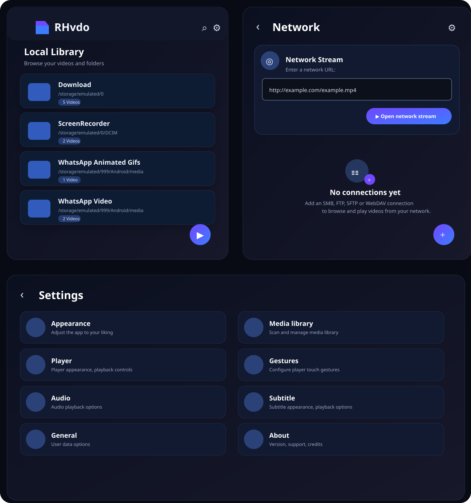

# RHvdo

<p align="center">
  
</p>

<p align="center">
  <strong>A modern, focused video player for Android.</strong><br>
  Browse local media, stream network content, and customize playback from a clean, dark interface.
</p>

<p align="center">
  <a href="#features">Features</a> ·
  <a href="#interface">Interface</a> ·
  <a href="#building">Building</a> ·
  <a href="#release-process">Releases</a> ·
  <a href="#license">License</a>
</p>

---

## Overview

**RHvdo** is a native Android video player designed around a simple principle: keep your media easy to browse and playback easy to control.

It combines a local media library, network playback, configurable player controls, subtitle and audio options, and a streamlined settings experience in one application.

## Features

### Local media

- Browse videos by folders.
- Media library with folder and file views.
- Video duration and item counts at a glance.
- Search functionality.
- Hardware and software decoder support.
- Picture-in-picture mode.
- Background playback.
- Android TV support.

### Network playback

- Play videos directly from network URLs.
- Browse and play media from network storage.
- **SMB, FTP, SFTP, and WebDAV** connection support.
- Designed for both direct URL playback and persistent network locations.

### Playback

- Audio track selection.
- Subtitle track selection.
- External subtitle support.
- Playback speed control.
- Zoom and swipe gestures.
- Configurable touch gestures.

### Customization

RHvdo keeps settings organized into focused sections:

- Appearance
- Media library
- Player
- Gestures
- Audio
- Subtitle
- General
- About

### Open source

- Free and open source.
- No advertising in the application.
- Built for Android with Kotlin.
- Licensed under the GNU General Public License v3.0.

## Interface

The RHvdo interface uses a modern dark visual system with rounded surfaces, clear hierarchy, subtle depth, and a focused accent color. The navigation structure keeps the main areas of the application accessible without adding unnecessary complexity.

The design concept shown above represents the current visual direction for:

- **Local Library** — folder-based media browsing.
- **Network** — URL streaming and network connection management.
- **Settings** — organized playback, library, appearance, and application preferences.

The underlying functionality and navigation remain centered around these same areas.

## Building

### Requirements

- Android Studio
- JDK 17
- Android SDK configured for the project

### Debug build

```bash
./gradlew assembleDebug
```

### Release build

```bash
./gradlew assembleRelease
```

Generated APK files are placed under:

```text
app/build/outputs/apk/
```

## Release Process

RHvdo releases use a single version source and verify the resulting APK before publishing.

```text
Manual workflow input
        ↓
versionName + versionCode
        ↓
Gradle build
        ↓
APK identity verification
        ↓
Git tag vX.Y.Z
        ↓
GitHub Release
```

The release workflow verifies that the APK contains the expected:

- `applicationId`: `io.github.faroffcode.rhvdo`
- `versionName`: requested semantic version
- `versionCode`: requested integer

Existing release tags are not overwritten.

## Development

1. Clone the repository.
2. Open the project in Android Studio.
3. Allow Gradle to synchronize.
4. Select the desired build variant.
5. Build and run on an Android device or emulator.

For contributions, keep changes focused and preserve existing playback, library, and navigation behavior unless the change specifically targets those areas.

## Project Status

RHvdo is actively developed. UI details, playback capabilities, and supported integrations may continue to evolve between releases.

## Contributing

Issues, bug reports, feature requests, documentation improvements, and code contributions are welcome.

For larger changes, open an issue first so the proposed direction can be discussed before significant implementation work begins.

## License

RHvdo is licensed under the **GNU General Public License v3.0**.

See [LICENSE](LICENSE) for the complete license text.

---

<p align="center">
  <strong>RHvdo</strong><br>
  Modern. Focused. Built for your videos.
</p>
